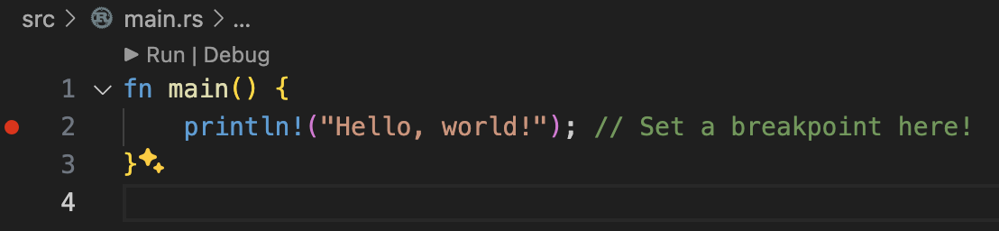
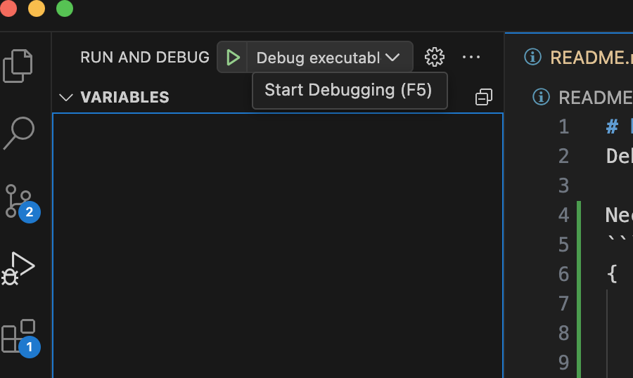
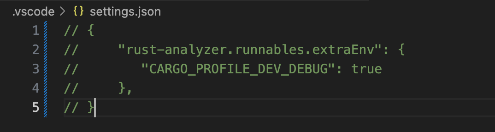
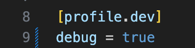
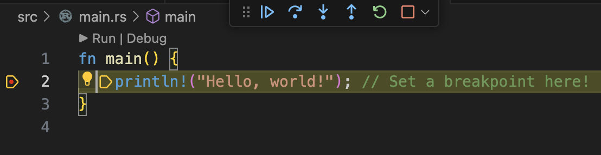

# Reproduction for vscode settings.

Expected behavior is the debugger will stop at a break point when executing run and debug by using the specified settings. However, it does not work well.

Necessary settings file `./.vscode/settings.json` for reproduction file is put with the following content and launch.json and `debug = 0` in the `Cargo.toml`.
```
{
    "rust-analyzer.runnables.extraEnv": {
       "CARGO_PROFILE_DEV_DEBUG": true
    },
}
```
This is valid only when pushing Debug on the above on the code. It means it is impossible when you use debugger with `launch.json` settings.

## Reproduction Steps

1. Set a breakpoint in the line `println!` like the picture.



2. Run and Debug by pushing `F5` on mac or select the RUN AND DEBUG from the left side bar.



3 The result is that debugger does not stop at the breakpoint, contrary to my expectation.

### Right setting to validate breakpoints.

1. Comment out `./.vscode/settings.json` and save it because it is not necessary.


2. Turn on debug by `debug = true` in the Cargo.toml and save it.

3. Set a breakpoint in the line `println!` like the picture.

4. Run and Debug by pushing `F5` on mac or select the RUN AND DEBUG from the left side bar.

5. Stopped at the breakpoint.

